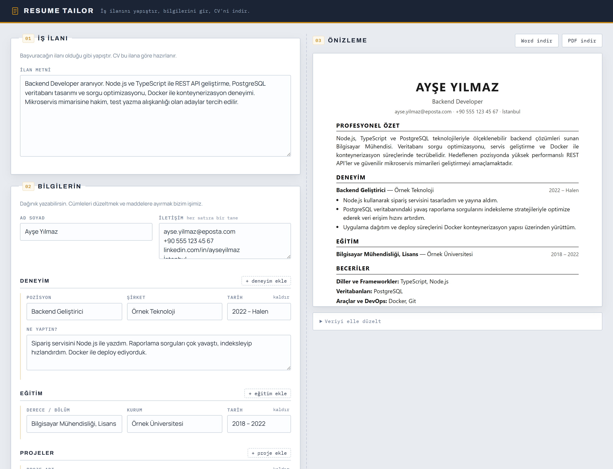
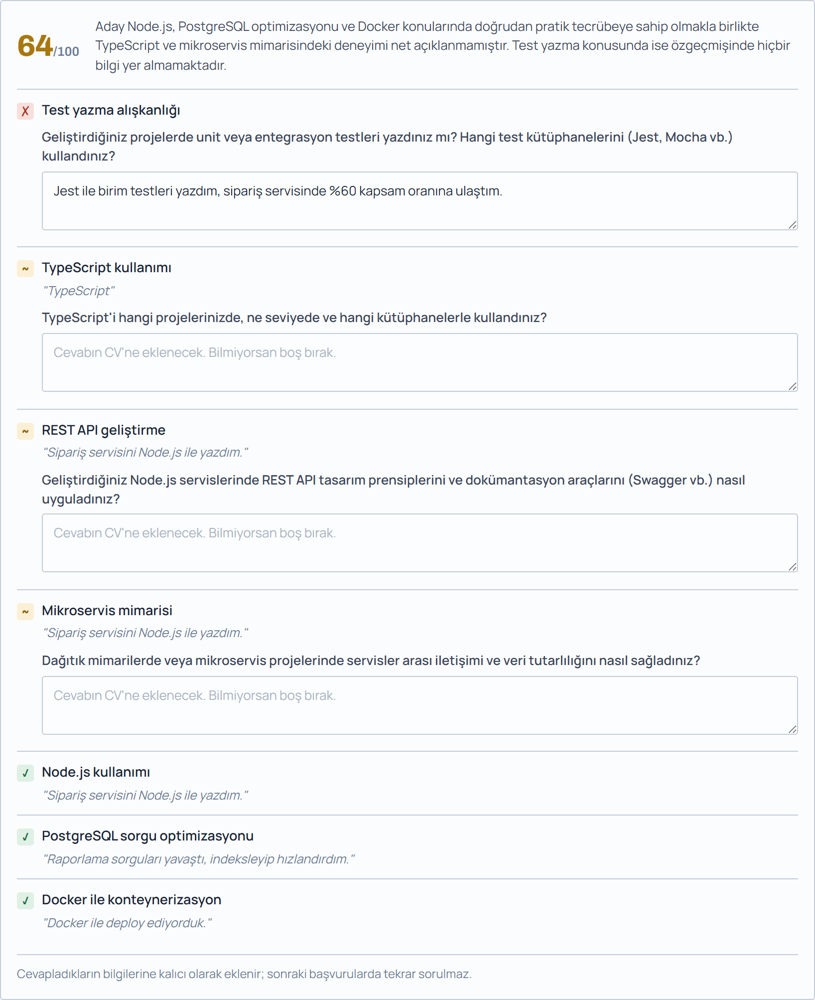
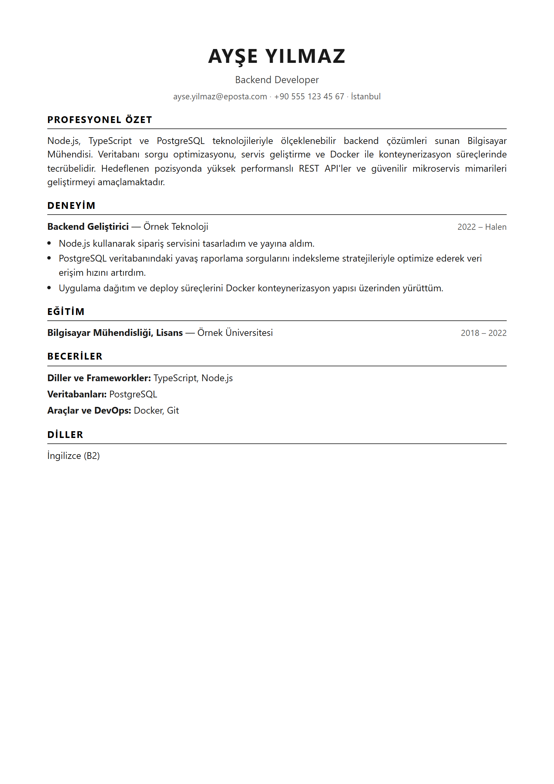

# Resume Tailor

**İş ilanına özel CV üreten web uygulaması.** Mevcut bir CV yüklemezsiniz — kendi
hakkınızdaki dağınık bilgileri girer, başvuracağınız ilanı yapıştırırsınız; sistem
o ilana göre sıfırdan bir CV kurar ve Word (.docx) + PDF olarak indirtir.



---

## Ne işe yarıyor?

Her ilana ayrı CV hazırlamak zaman alır. Bu araç, aynı ham bilgiden **her ilan için
farklı bir CV** üretir: ilanla alakalı deneyim ve becerileri öne çıkarır, özeti o role
göre yazar, dağınık cümlelerinizi düzgün maddelere çevirir.

Örneğin şunu yazarsanız:

> "Raporlama sorguları çok yavaştı, indeksleyip hızlandırdım."

CV'de şöyle görünür:

> • PostgreSQL veritabanındaki yavaş raporlama sorgularını indeksleme stratejileriyle
>   optimize ederek veri erişim hızını artırdım.

**Uydurmaz.** Vermediğiniz bir şirketi, tarihi ya da teknolojiyi eklemez; ölçmediğiniz
bir başarı için yüzde uydurmaz. Bu kurallar [`cvPrompts.ts`](src/prompts/cvPrompts.ts)
içinde açıkça tanımlıdır.

### İlan uyum analizi

Sistem ilanın istediklerini profilinizle karşılaştırır. Eksik gördüğü yeri kendi
doldurmaz — size sorar. Verdiğiniz cevap doğrudan CV ve ön yazıya girer.



### Örnek çıktı



---

## Özellikler

- **İlana göre uyarlama** — Aynı profilden her ilan için farklı CV
- **İlan uyum skoru** — İlanın gereksinimlerini çıkarır, profilinizle karşılaştırır, 0-100 puan verir
- **Eksik analizi** — Karşılanmayan her gereksinim için somut bir soru sorar; cevabınız profile kalıcı olarak eklenir ve sonraki başvurularda kullanılır
- **Ön yazı üretimi** — Aynı profil ve ilandan, CV'yi tekrarlamayan 150-250 kelimelik ön yazı
- **Canlı önizleme** — İndirmeden önce CV'yi ekranda görürsünüz; gördüğünüz, indirdiğinizin birebir aynısıdır
- **İki format** — PDF (başvuru için) ve Word (kendiniz düzenlemek için; gerçek paragraf ve madde listeleriyle)
- **Elle düzeltme** — Beğenmediğiniz bir kelimeyi JSON panelinden değiştirip önizlemeyi yenilersiniz; LLM'e tekrar gidilmez
- **Türkçe karakter desteği** — İ, Ğ, Ş her iki formatta da sorunsuz
- **Mock mod** — `MOCK_LLM=true` ile API kotası harcamadan tüm akışı denersiniz
- **Geçici hatalara dayanıklılık** — Gemini yoğunken (503) veya hız sınırında (429)
  otomatik olarak 3 kez, artan beklemeyle tekrar dener; hata mesajları sebebe göre ayrışır
- **Otomatik taslak kaydı** — Form tarayıcıda saklanır, sekmeyi yenilerseniz kaybolmaz

---

## Teknoloji

| Katman | Teknoloji |
|---|---|
| Sunucu | Node.js 24 + Express 5 |
| Dil | TypeScript (derlemesiz — Node'un yerleşik "type stripping" özelliğiyle) |
| LLM | Google Gemini (`@google/genai`, structured output) |
| Doğrulama | Zod 4 |
| PDF | HTML/CSS şablonu → Puppeteer |
| Word | `docx` paketi |
| Arayüz | Vanilla JS + CSS (build adımı yok, framework yok) |

Veritabanı yok, oturum yönetimi yok, build aracı yok.

---

## Kurulum

Node.js **24 veya üzeri** gerekir (TypeScript'i doğrudan çalıştırabilmek için).

```bash
git clone <repo-url>
cd cv_olustur
npm install
```

Puppeteer'ın Chromium'u inmediyse (npm'in script koruması engelleyebilir):

```bash
npx puppeteer browsers install chrome
```

Ortam dosyasını oluşturun:

```bash
cp .env.example .env
```

`.env` içine [Google AI Studio](https://aistudio.google.com/apikey) anahtarınızı yazın:

```
GOOGLE_API_KEY=AIza...
```

| Değişken | Anlamı |
|---|---|
| `GOOGLE_API_KEY` | Google AI Studio anahtarı |
| `GEMINI_MODEL` | Varsayılan `gemini-3.6-flash` |
| `MOCK_LLM` | `true` iken Gemini'ye hiç istek atılmaz, sabit örnek CV döner |
| `PORT` | Varsayılan `8787` |

---

## Çalıştırma

```bash
npm run dev
```

Ardından **http://localhost:8787** adresini açın.

| Komut | İş |
|---|---|
| `npm run dev` | Sunucuyu başlatır, dosya değişince yeniler |
| `npm start` | Sunucuyu başlatır |
| `npm test` | Testleri çalıştırır |
| `npm run typecheck` | `tsc --noEmit` |

> `.env` değişikliği için sunucuyu elle yeniden başlatmanız gerekir — `--watch`
> yalnızca `src/` altındaki kodu izler.

---

## Proje yapısı

```
src/
├── server.ts                  Express giriş noktası, middleware montajı
├── config.ts                  .env okuma, eksik anahtarda fail-fast
├── errors.ts                  AppError / LlmError / RenderError
├── routes/cv.ts               API uç noktaları
├── middleware/errorHandler.ts Hataları tek tip JSON'a çevirir
├── schemas/
│   ├── cvSchema.ts            CVData şeması (LLM çıktısı)
│   ├── analysisSchema.ts      İlan uyum analizi şeması
│   ├── letterSchema.ts        Ön yazı şeması
│   └── requestSchema.ts       İstek gövdelerinin şemaları
├── prompts/cvPrompts.ts       Sistem promptu + profil biçimlendirme
└── services/
    ├── llm.ts                 Gemini çağrıları (CV, analiz, ön yazı) + doğrulama
    ├── mockCv.ts              LLM'siz çalışmak için sahte veri
    ├── cvHtml.ts              CVData → HTML (önizleme ve PDF ortak kullanır)
    ├── letterHtml.ts          LetterData → HTML
    ├── pdfBuilder.ts          HTML → Puppeteer → PDF (CV ve ön yazı)
    └── docxBuilder.ts         CVData / LetterData → Word

public/                        index.html · style.css · app.js
tests/                         Node'un yerleşik test koşucusu
```

---

## Nasıl çalışıyor?

Verinin üç hâli vardır; projedeki her dosya bu dönüşümlerden birine hizmet eder:

```
① Profile  ──(Gemini)──►  ② CVData  ──(bizim kod)──►  ③ HTML / PDF / Word
  dağınık girdi            yapılandırılmış               çıktılar
```

Bir isteğin yolculuğu:

```
[Tarayıcı] app.js → POST /api/generate-cv { profile, jobPosting }
     ▼
[routes/cv.ts]  Zod ile gövdeyi doğrula  ──✗──► 400
     ▼
[services/llm.ts]  prompt kur → Gemini (responseSchema) → JSON.parse
     ▼              → CVDataSchema.safeParse  ──✗──► 502
[routes/cv.ts]  res.json({ cvData })         ← DOSYA ÜRETİLMEZ
     ▼
[Tarayıcı] POST /api/preview → HTML → iframe'de göster
     ▼
[Tarayıcı] "PDF indir" → POST /api/render/pdf { cvData } → dosya
```

**Üretim ve render neden ayrı?** LLM adımı yavaştır (~8-10 sn) ve kota harcar; dosya
render'ı hızlı ve deterministiktir. Ayırınca kullanıcı indirmeden önce CV'yi görüp
düzeltebilir ve bir formatı yeniden üretmek LLM'e hiç gitmez.

### API

| Method | Endpoint | Gövde | Cevap |
|---|---|---|---|
| GET | `/api/health` | — | `{ ok, mockLlm }` |
| POST | `/api/generate-cv` | `{ profile, jobPosting }` | `{ cvData }` |
| POST | `/api/preview` | `{ cvData }` | `text/html` |
| POST | `/api/render/docx` | `{ cvData }` | `.docx` |
| POST | `/api/render/pdf` | `{ cvData }` | `.pdf` |
| POST | `/api/analyze` | `{ profile, jobPosting }` | `{ analysis }` |
| POST | `/api/generate-letter` | `{ profile, jobPosting }` | `{ letterData }` |
| POST | `/api/preview-letter` | `{ letterData }` | `text/html` |
| POST | `/api/render/letter-docx` | `{ letterData }` | `.docx` |
| POST | `/api/render/letter-pdf` | `{ letterData }` | `.pdf` |

---

## Tasarım kararları

**Katman ayrımı** — Route katmanı HTTP dışında bir şey bilmez (Gemini SDK'sını import
etmez); servisler HTTP bilmez (`req`/`res` görmez). Bu yüzden `buildDocx(cvData)`
fonksiyonunu test etmek için sunucu ayağa kaldırmak gerekmez.

**Zod, iki sınırda** — Hem tarayıcıdan gelen gövde hem Gemini'den gelen JSON doğrulanır.
Model şema verilse bile alan atlayabilir. `.default([])` sayesinde eksik diziler boş dizi
olarak normalize edilir; render katmanı hiç `undefined` görmez.

**Çift şema** — Gemini, JSON Schema'nın kısıtlı bir alt kümesini kabul eder
(`$ref`, `additionalProperties` reddedilir), bu yüzden otomatik dönüşüm çalışmaz.
`llm.ts` içindeki elle yazılmış şema modele *biçim tarif eder*; `CVDataSchema` ise
çıktıyı *doğrular*. Son söz her zaman Zod'undur.

**Puppeteer** — PDF kütüphanelerinin gömülü fontları Türkçe büyük harfleri (İ, Ğ, Ş)
desteklemez; Chrome Unicode'u doğal olarak destekler. Ayrıca sayfa düzenini CSS ile
yazmak, kutuları koordinatla konumlandırmaktan çok daha hızlıdır. Bedeli ~150MB Chromium.

**Tek HTML şablonu** — `cvHtml.ts` hem önizlemeyi hem PDF'i üretir; iki ayrı şablon
olsaydı kaçınılmaz olarak birbirlerinden ayrı düşerlerdi.

**Durumsuz sunucu** — `cvData` sunucuda saklanmaz; tarayıcının belleğinde yaşar ve
indirme isteğinde geri gönderilir. Veritabanı ve oturum yönetimi gerekmez.

---

## Bilinen sınırlar

- **Kimlik doğrulama ve rate limiting yok.** Bu hâliyle yerel/tek kullanıcılık bir
  araçtır. Herkese açık bir sunucuya koyacaksanız ikisini de eklemek şart — her istek
  LLM kotası harcar.
- **Tek Chromium örneği.** Aynı anda çok sayıda PDF isteği geldiğinde sekme havuzu
  veya kuyruk gerekir.
- **Ücretsiz kota günde 20 istek.** `gemini-3.6-flash` için Google'ın ücretsiz
  katman sınırı düşük; her CV, analiz ve ön yazı ayrı bir istek harcar. Yoğun
  kullanımda ücretli plana geçmek gerekir.
- **Serbest sohbet yok.** Sistem eksik bilgi için soru sorar (ilan analizi), ancak
  serbest bir sohbet arayüzü yoktur; giriş yalnızca formdur.
- **Analiz yavaş.** Gemini'nin gereksinimleri çıkarıp karşılaştırması 15-40 saniye
  sürebilir; CV üretiminden belirgin şekilde uzun.
